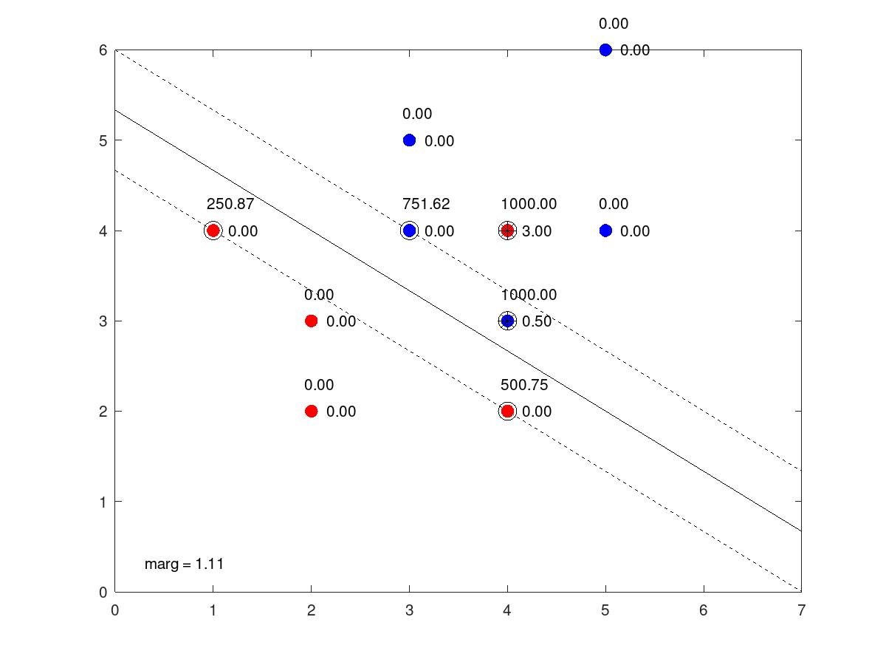
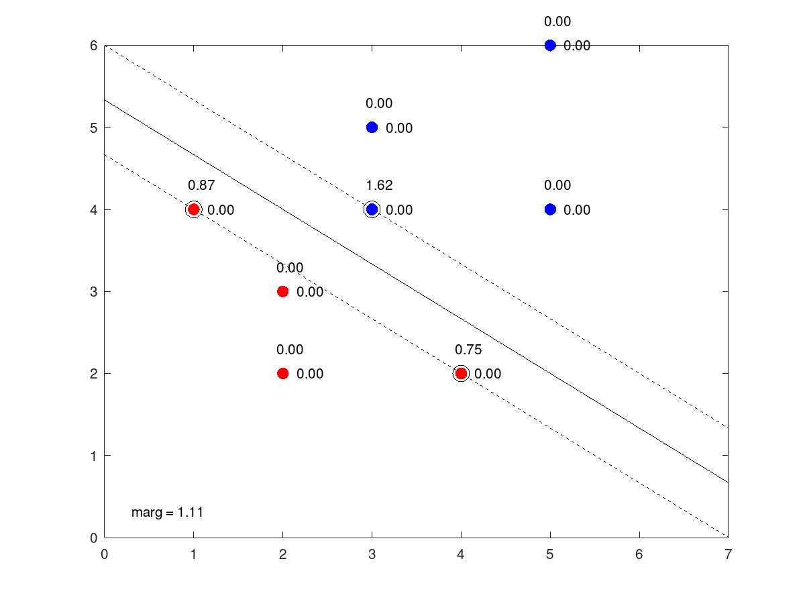

# Practica 2: Máquinas de vectores soporte

###### Miguel Edo GoterrisLuis

###### Serrano Hernández


### Introducción

La finalidad de esta práctica es experimentar con SVM, entender mejor su funcionamiento y calcular sus parámetros. Para ello se nos dan los conjuntos de datos `tr.dat` y `trSep.dat` que son dos pequeños conjuntos de datos, el primero de ellos linealmente separable y el segundo no.


### Ejercicio 3

Para llevar a cabo este ejercicio hemos entrenado la SVM con los dos conjuntos de datos anteriormente mencionados usando la instrucción `svmtrain(trlabels, tr, "-q -t 0 -c 1000")`

A partir de los datos que nos devuelve esta instrucción hemos podido obtener de forma directa los multiplicadores de Lagrange mediante la orden `res.sv_coef` y los vectores de soporte mediante la orden `tr(res.sv_indices,:)`

El vector de pesos, el peso umbral y el margen de la función lineal se han calculado mediante el siguiente código:

```octave
% x = vectores de soporte 
% alpha = multiplicador de lagrange optimo

theta =  sum(x .* alpha)

aux = find(theta < c);
theta0 = sign(res.sv_coef(aux(1))) - theta*res.SVs(aux(1),:)' 

margen = 2 / norm(theta)
```


Los resultados obtenidos son los siguientes:

|                               | tr                                                     | trSep                              |
| ----------------------------- | ------------------------------------------------------ | ---------------------------------- |
| **Multiplicador de Lagrange** | 250.87<br/>500.75<br/>1000.00<br/>-751.62<br/>-1000.00 | 0.87472<br />0.74989<br />-1.62461 |
| **Vectores soporte**          | 1   4<br/>4   2<br/>4   4<br/>3   4<br/>4   3          | 1   4<br/>4   2<br/>3   4          |
| **Vector de pesos**           | -0.99955  -1.49977                                     | -0.99955  -1.49978                 |
| **Peso umbral**               | 7.9986                                                 | 7.9987                             |
| **Margen**                    | 1.1097                                                 | 1.1097                             |


Al dibujar las gráficas correspondientes a los dos conjuntos de datos obtenemos las siguientes imágenes:

##### No separable




##### Separable




### Ejercicio 4 

En este apartado se nos pide entrenar una SVM con los datos MNIST. Tras probar varios kernels el único que es viable emplear es el polinomial puesto que es el único que termina en un tiempo razonable. 

También hemos observado que las variaciones de C no afectan a la precisión o intervalo de confianza, de modo que para todos los test hemos usado C = 1000.

Por ultimo, si que hemos podido apreciar que la variación del grado del polinomio tenia efecto sobre la precisión del modelo entrenado, así que los test se han realizando alterando este parámetro.

Estos son los resultados obtenidos:

| Grado polinomio | Precisión (%) | Intervalo confianza (%) |
| :-------------- | ------------- | ----------------------- |
| 2               | 98.05         | 0.27102                 |
| 3               | 97.91         | 0.28038                 |
| 4               | 97.37         | 0.31365                 |
| 5               | 96.65         | 0.35268                 |
| 6               | 95.88         | 0.38955                 |
| 7               | 94.73         | 0.43793                 |
| 8               | 93.64         | 0.47832                 |
| 9               | 92.58         | 0.51371                 |


Se puede concluir que la mejor opción es un kernel polinómico de grado 2, con el que obtenemos una tasa de precisión del 98.05% y un intervalo de confianza del 0.27%.